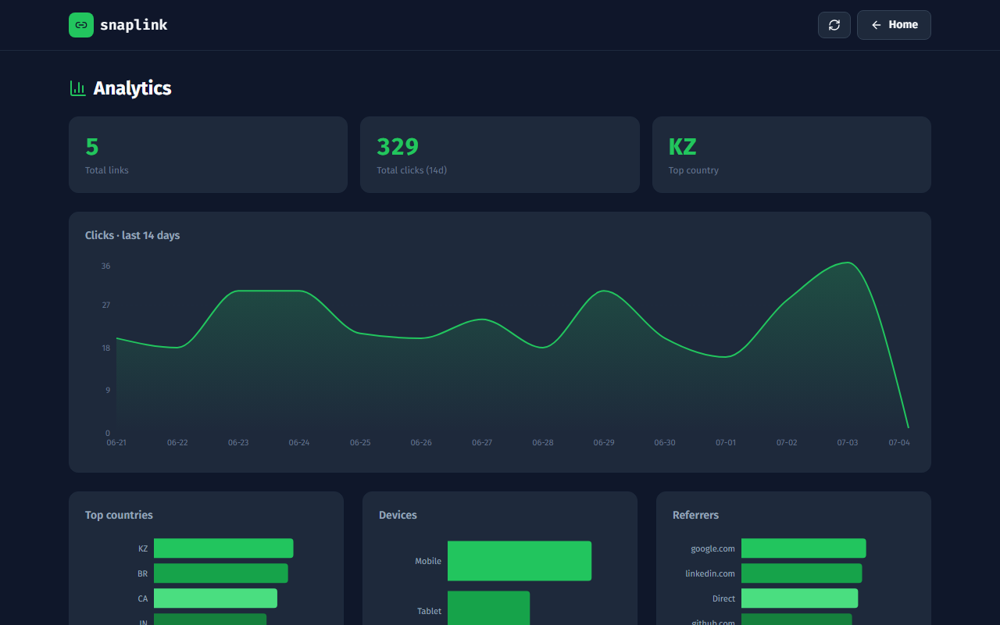

# Snaplink — Short links with real analytics

Shorten any URL and see exactly who clicks it: a 14-day click trend, top countries,
device split, and referrers — all aggregated from individual click events.

**Stack:** Next.js 14 (App Router) · TypeScript · **Prisma ORM · PostgreSQL** · Tailwind CSS · Recharts

🔗 **Live demo:** _deployed on Vercel_ (see Deploy)



---

## ✨ What it does

- **Instant shortening** — clean 6-char slugs (no ambiguous `0/O`, `1/l`), stored in PostgreSQL via Prisma.
- **Exact click tracking** — every visit is one row in a `Click` table, so analytics are precise, not estimated.
- **Analytics dashboard** — clicks over time, top countries, device split (desktop/mobile/tablet), and referrers.
- **Reliable redirects** — click logging never blocks the redirect: if analytics fail, the visitor still lands instantly.

## 🗄 Data model (Prisma)

```prisma
model Link  { id, slug @unique, url, createdAt, clicks Click[] }
model Click { id, linkId, country, device, referrer, createdAt }
```

Analytics are aggregated from `Click` rows at query time (clicks-per-day, top-N by dimension).

## 🏗 Architecture

```
Next.js App Router
├─ /              landing + instant shorten box
├─ /dashboard     KPIs, click trend (Recharts), geo/device/referrer, links table
├─ /[slug]        redirect route → logs a Click → 302 to the target URL
├─ /api/shorten   validate URL → create Link (Prisma)
└─ /api/stats     aggregate Click rows into the dashboard payload
lib/prisma.ts     PrismaClient singleton
prisma/schema.prisma · prisma/seed.ts
```

## 🚀 Run locally

```bash
npm install
cp .env.example .env        # set DATABASE_URL + DIRECT_URL to your Postgres
npx prisma db push          # create the tables
npm run db:seed             # optional: demo links + click history
npm run dev                 # http://localhost:3008
```

Works with any PostgreSQL (Supabase, Neon, local). `DATABASE_URL` is the pooled
connection; `DIRECT_URL` is used for migrations.

## 📦 Deploy (Vercel)

Set `DATABASE_URL`, `DIRECT_URL` and `NEXT_PUBLIC_BASE_URL` as environment variables,
then deploy. `prisma generate` runs automatically on build.

---

*Portfolio project by [Ilya Shapovalov](https://github.com/yagaMI-Reverse). Seed data is fictional.*
